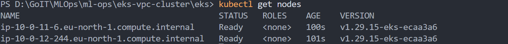

# ml-ops

# EKS & VPC Terraform Project

This project sets up an EKS cluster in a new VPC using Terraform modules.

## Structure

- `main.tf`: Root module that calls the `vpc` and `eks` modules.
- `variables.tf`: Root variables.
- `outputs.tf`: Root outputs.
- `terraform.tf`: Provider configuration.
- `backend.tf`: S3 backend configuration.
- `vpc/`: VPC module.
  - `main.tf`: Uses `terraform-aws-modules/vpc/aws`.
  - `variables.tf`: VPC input variables.
  - `outputs.tf`: VPC outputs.
- `eks/`: EKS module.
  - `main.tf`: Uses `terraform-aws-modules/eks/aws`.
  - `variables.tf`: EKS input variables.
  - `outputs.tf`: EKS outputs.

## How to Run

1.  **Initialize Terraform:**
    ```bash
    terraform init
    ```

2.  **Plan the changes:**
    ```bash
    terraform plan
    ```
    **VPC**:
    


    **EKS**:
    

3.  **Apply the changes:**
    ```bash
    terraform apply
    ```

4.  **Configure kubectl:**
    After `apply` is complete, configure `kubectl` to connect to your new cluster:
    ```bash
    aws eks --region <your-region> update-kubeconfig --name <your-cluster-name>
    ```
    

5.  **Verify nodes:**
    Check that your nodes are running:
    ```bash
    kubectl get nodes
    ```
    