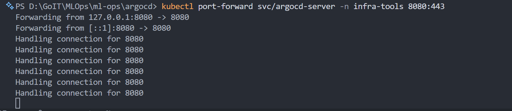
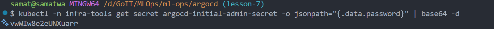
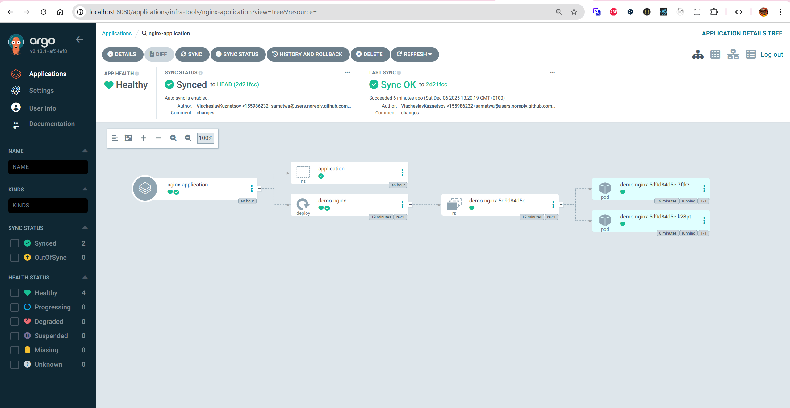
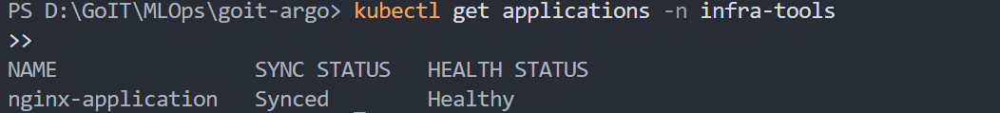
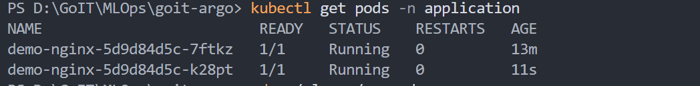
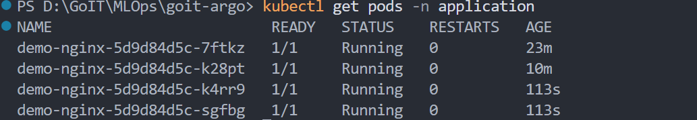

# goit-argo

Цей репозиторій містить конфігураційні файли Kubernetes для розгортання додатків за допомогою ArgoCD.

## Початок роботи

### 1. Розгортання інфраструктури

Для розгортання EKS кластера та встановлення ArgoCD виконайте наступні кроки у репозиторії `ml-ops`:

```bash
# Ініціалізація Terraform
terraform init

# Застосування конфігурації
terraform apply
```

### 2. Перевірка роботи ArgoCD

Після успішного виконання `terraform apply`, переконайтесь, що ArgoCD працює:

```bash
# Перевірка подів ArgoCD
kubectl get pods -n infra-tools

```


### 3. Доступ до ArgoCD UI

Щоб отримати доступ до веб-інтерфейсу ArgoCD, виконайте port-forward та отримайте пароль:

```bash
# Port-forward для доступу до UI
kubectl port-forward svc/argocd-server -n infra-tools 8080:443



# Отримання пароля для користувача admin
kubectl -n infra-tools get secret argocd-initial-admin-secret -o jsonpath="{.data.password}" | base64 -d


```

Після цього відкрийте `https://localhost:8080` у вашому браузері. Логін - `admin`.



### 4. Перевірка розгортання додатку

ArgoCD автоматично синхронізує додаток, описаний у `application.yaml` з цього репозиторію.

Перевірте статус додатку в UI ArgoCD або через `kubectl`:

```bash
# Перевірка статусу ArgoCD Application
kubectl get applications -n infra-tools


# Перевірка подів nginx у неймспейсі application
kubectl get pods -n application




```

### Посилання

*   [Git-репозиторій з ArgoCD Application](https://githukubectl -n argocd get secret argocd-initial-admin-secret -o jsonpath="{.data.password}" | base64 -db.com/samatwa/goit-argo)
